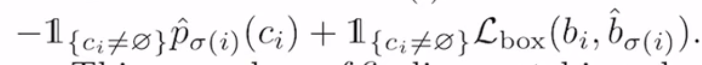
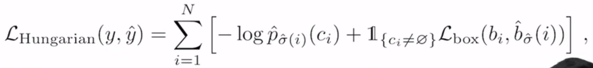
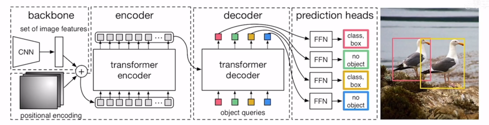
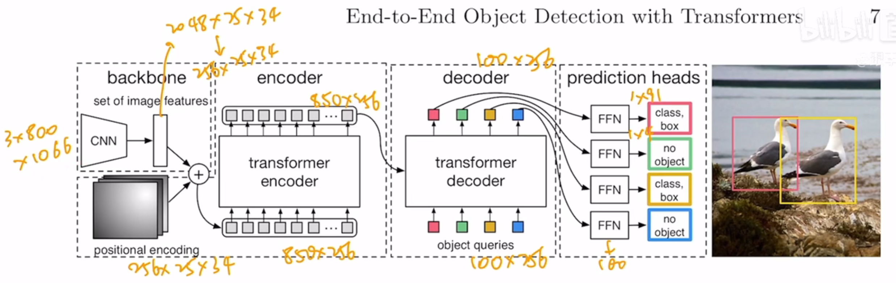
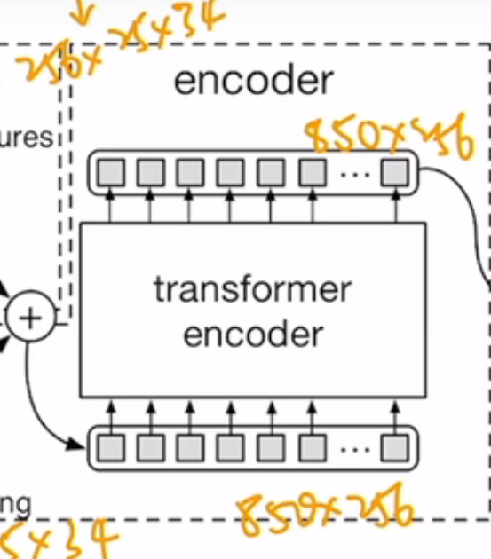
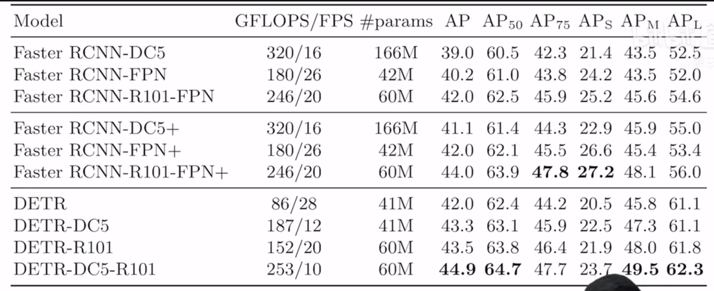
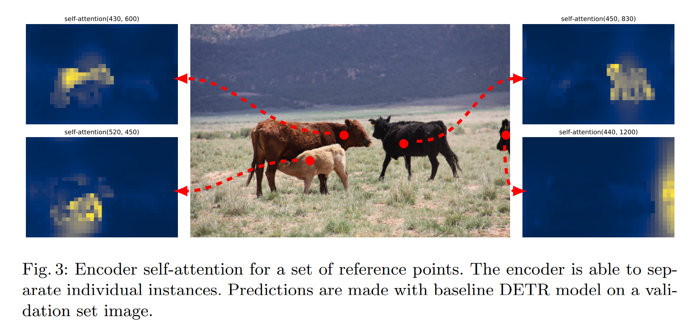
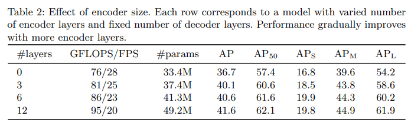
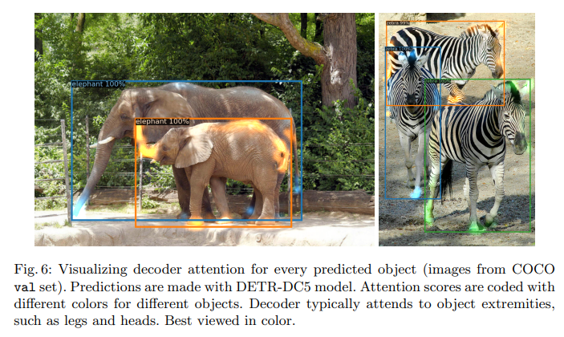
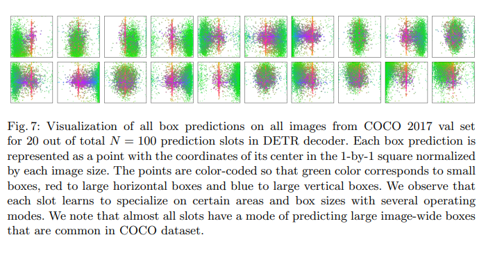

- 
- 算法
	- DETR 模型最后输出是一个固定的集合，无论输入是什么，最后都会输出 N 个输出
	- 问题：DETR 每次都会输出 100 个输出，但一张图片的 Ground Truth 的 banding box 只有几个，如果做匹配，去算 loss
	- 解决：将问题转换成 [[二分图匹配问题]]，用 scipy 包里的 $linear-sum-assignment$ 函数
		- 于是把 abc 看成 DETR 的 100 个框，xyz 看成是 ground truth 的框（cost matrix 不一定是正方形）
		- cost matrix 最后输出的是 loss，用函数计算 
			- $+$ 号前分类 loss，后出框准确度 loss
	- 最后的目标函数 
		- 依然是分类的 loss 和出框的 loss
		- 出框处用了generalized iou loss（与框大小无关的目标函数）和 $L_1 loss$ 的合体，是因为用了 Transformers 的全局特征，对大物体友好，经常出大框，这也导致了 loss 会更大，所以这里不止使用 $L_1 loss$
	- 整体网络框架
	  
		- 
		- backbone
			- 输入 3 * 800 * 1066 的图片（检测分割输入图片都会大一些，而分类基本是 24 * 24），通过卷积网络得到特征，走到最后一层（conv5）时，得到 2048 * 25 * 34 （800 和 1066 的 $\frac{1}{32}$）这么一个特征
			- 因为要把特征给 Transformers，所以做了一次 1 * 1 的降维操作，把 2048 变成 256，所以从卷积神经网络出来的特征维度就是 256 * 25 * 34
			- 接下来要进入 Transformers，而 Transformers 是没有位置信息的，所以要加入位置编码
				- 此处是一个固定的位置编码，维度大小也是 256 * 25 * 34，目的是要和特征信息加在一起，所以保持维度一致
		- encoder
			- 以上便是 Transformer 的输入，接下要要把向量拉直，即把 h(25) 和 w(34) 拉直，变成一个数值，即 850 * 256。850 是序列长度，256 是 Transformers的 head dimension。后面就与普通的 Transformers encoder 或 VisionTransformer 一样。不管过了多少个 Transformers encoder block，输出还是 850 * 256。在 DETR 中，作者使用了 6 个 Encoder，即 6 个 Transformers Encoder 叠起来
			  
		- decoder
			- decoder 中有一个新东西：object query，是一个 learnable positional embedding，可以学习，维度是 100 * 256，256 是为了和之前的维度对应，才好一起做惩罚。100 是告诉模型，最后要得到 100 个输出，可以理解成 Anchor 的机制，或 condition
			- 在 transformers decoder 中做的是 cross Attention
			- 一个输入是object queries  100 * 256，另一个输入是从图像端拿来的全局特征 850 * 256
			- 这时拿 800 * 256 和 100 * 256 反复做自注意力操作，得到 100 * 256 的特征
			- DETR 中也用了 6 层 decoder，输入输出维度不变，始终 100 * 256
			- 补充材料说明
				- 在 transformers decoder 里，每一个 decoder 都会先做一次 object queries 的自注意力操作（第一层可以省掉不做，后面的层不能省掉）
				- object queries 做自注意力操作，主要是为了移除冗余框，因为互相通信后，就知道每个 query 可能能得到什么样的一个框，就尽量不要去做重复的框
		- prediction heads
			- 拿到 100 * 256 之后，最后就要做预测，加一个标准的检测头，feed forward network，即一些 MLP
			- 准确的说，将特征给全连接层，全连接层就会做两个预测
				- 物体类别的预测
					- 如果是 COCO 就是 91 类
				- 出框预测
					- 框就是四个值，x, y 对应出框中心点，以及框的高度和宽度
			- 一旦有了 100 个预测框，就可以和 Ground Truth 里的两个框去做最优匹配，然后用匈牙利算法去算得最后的目标函数，然后梯度反向回传以更新模型。
		- 端到端的可以学习的 DETR 模型就实现了
		- 补充材料说明
			- 最后算 loss 的时候，作者发现为了让模型训练得更快或训练得更稳定，在 decoder 后面加了很多 auxiliary loss（额外的目标函数），这是很常见的 trick，在检测和分割，尤其是分割里特别常见。即不光在最后一层去算这个 loss，在之前的 decoder 里也去算 loss
			- 因为每个 decoder 的最后输出都是 100 * 256，所以都可以在 100 * 256 上去做 FFN，然后得到输出
			- 也就是六个 decoder 后面都加了 FFN，从而得到目标检测的输出，去算 loss
			- FFN 都是共享参数
	- 简化后 DETR 代码
		- ```python
		  import torch
		  from torch import nn
		  from torchvision.models import resnet50
		  
		  class DETR(nn.Module):
		    
		    def __init__(self, num_classes, hidden_dim, nheads,
		                  num_encoder_layers, num_decoder_layers):
		    # DETR 初始化
		        super().__init__()
		        # We take only convolutional layer from ResNet-50 model
		        self.backbone = nn.Sequential(*list(resnet50(pretrained=True).childern())[:2])
		        # 卷积神经网络的 backbone，找了一个 Pretrained 好的 resnet50，然后将 backbone 抽出来
		        self.conv = nn.Conv2d(2048, hidden_dim, 1)
		        # 投射层，把 2048 变成 256
		        self.transformer = nn.Transformer(hidden_dim, nheads,
		                                          num_encoder_layers, num_decoder_layers)
		        # 定义需要的 Transformers encoder 和 decoder，decoder 
		        # 最后就会给一个 100 * 256 的特征，基于特征就可以做预测了
		        self.linear_class = nn.Linear(hidden_dim, num_classes + 1)
		        # 预测的时候需要两个 FFN，一个是做类别的预测
		        self.linear_bbox = nn.Linear(hidden_dim, 4)
		        # 另一个 FFN 就是做框的预测
		        self.query_pos = nn.Parameter(torch.rand(100, hidden_dim))
		        # object query，设的是 100
		        self.row_embed = nn.Parameter(torch.rand(50, hidden_dim // 2))
		        self.col_embed = nn.Parameter(torch.rand(50, hidden_dim // 2))
		        # 两个 positioning embedding 是最开始跟卷积神经网络出来的特征夹在一起的固定 embedding
		  
		    def forward(self, inputs):
		    # 前向过程
		        x = self.backbone(inputs)
		        # 给一个输入，过一下 backbone，得到一个 2048 的特征
		        h = self.conv(x)
		        # 2048 特征过一下投射层，变成 256 特征
		        H, W = h.shape[-2:]
		        pos = torch.cat([
		            self.col_embed[:W].unsqueeze(0).repeat(H, 1, 1),
		            self.row_embed[:H].unsqueeze(1).repeat(1, W, 1),
		        ], dim=-1).flatten(0, 1).unsqueeze(1)
		        # 因为给了 Transformers，需要位置信息，所以设一个位置信息编码
		        h = self.transformer(pos + h.flatten(2).permute(2, 0, 1),
		                            self.query_pos.unsqueeze(1))
		        # 得到 256 特征之后，要拉直，所以 h 去做 flatten，拉直了变成 850 * 256 特征了
		        # 位置信息编码和 h 相加，就是 Transformers 的输入了
		        # 同时 Transformers 里不仅有 encoder 还有 decoder，decoder 输入还需要有一个 object query
		        # 所以要把 query position enquery 也传进去
		        # 所以 Transformers 得到了两个输入，一个是图像那边来的全局特征输入，一个是 object query 的输入
		        # 经过了 Transformers encoder 和 decoder，最后得到 100 * 256 的特征 h
		        return self.linear_class(h), self.linear_bbox(h).sigmoid()
		        # 基于 h 做一次 FFN，得到了物体类别的判断，再做一次 FFN，就得到了框的判断
		  
		  detr = DETR(num_classes=91, hidden_dim=256, nheads=8, num_encoder_layers=6, num_decoder_layers=6)
		  # 定义一个 DETR 模型，像 COCO 有 91 个类，Transformers 里的 Hidden Dimension 是 256，
		  # 多头自注意力 8，6 个 encoder layers 和 decoder layers
		  detr.eval()
		  inputs = torch.randn(1, 3, 800, 1200)
		  logits, bboxes = detr(inputs)
		  # 最后得到了 ligits 和 bandingboxes
		  
		  # 完全没有 nms 的后处理操作，而且整体结构简单直白
		  ```
- 实验
	- 对比 DETR 和 Faster RCNN 性能
	  
		- 第二列是作者在原基础上改变训练策略，把 Faster RCNN 重新训练一遍，得到的提升版，主要是做中间的对比
		- DC5 模型，FPS 跑起来速度差不多，Faster RCNN 稍快，但 gflops 小了差不多一半，模型小
			- 参数量 DETR 也是只有 41M，但推理过程中还是跑得慢
			- AP 高了两个点
		- 把 backbone 换成 R101，再加上 FPN，与DETR-DC5-R101 比较
			- 参数量同样是 60M，GFLOPS 也是 250 左右，但 DETR FPS 还是慢了一倍，但效果好
		- 重点放在细分类上的比较，小物体($AP_S$) 和大物体($AP_L$)，DETR 和 Faster RCNN 的差别
			- 小物体中，Faster RCNN 表现特别好，大物体是 DETR 效果好
		- 作者解释：因为用的 Transformers 这个全局建模，而且没有用 anchor，所以 DETR 想检测多大的物体都可以
			- 而 DETR 框架实在过于简单，没有使用多尺度的特征，没有用 FPN，也没有用特别复杂的目标检测头，所以对小物体处理就不好
	- 可视化图
	  
		- 图三中把 Transformer encoder，即编码器的自注意力可视化了
		- 比如图里有牛，如果在牛上点一些基准点，然后用这个基准点，去算这个点和这个图像里所有其他点的自注意力，然后看看自注意力是怎么分布的。
		- 自注意力的效果特别好，其实基本已经把牛的形状恢复出来了，甚至有点实例分割出来的那个 mask 的形状了，而且对于遮挡这么严重的情况，小牛身在大牛上面，还是能把两头牛分得很清楚
		- 当使用 Transformer encoder 之后，图片中的物体已经分得很开了，这个时候再去做 decoder，做目标检测或者分割，任务就简单很多了
	- Transformers 编码器数值上的表现
	  
		- 随着层数的增加，性能也一直在变好，也并没有饱和的现象。
		- 但层数的增加会带来参数的增长和速度的变慢，需要取一些 trade off，一般来说取 3 层就够，作者取的是 6 层
		- Transformer 取的层数越深，编码器学到的全局特征就越好，可视化就会越清晰，物体和物体之间就会分得越开
	- Transformer 解码器
	  
		- 因为也是一个 Transformer block，所以也有自注意力去可视化。图中把每个物体的自注意力，用不同颜色去表示
		- 遮挡这么严重的情况下，后面的大象蹄子、尾巴都能显示出蓝色。大象小象皮肤这么贴近，轮廓还是能分得非常清楚
		- encoder 在学习一个全局的特征，尽可能让物体和物体之间分得开。但对于头、尾巴、对外围的点等这些极值点，就要交给 decoder，decoder 把所有的注意力都分到去学边缘。更好地区分物体，以及解决遮挡问题。
		- 有点像之前做分割用的 U-net 结构，encoder 去抽一个更有语义的特征，decoder 一点一点把图片大小恢复出来，另外把更多的细节加进去，从而确保最后的分割效果或者图片重建的效果很好
	- Object query 可视化
	  {:height 379, :width 700}
		- 作者把 coco 的 validation set 里所有的图片得到最后所有的输出框全部可视化，虽然 N 是 100，但只画出其中 20 个，每一个正方形代表一个 Object query，验证 Object query 到底学了什么
		- 图里绿色的点代表小的 banding box，红色的点代表大的横向的 banding box，蓝色的点代表竖向的，大的 banding box
		- 图中分布，object query 和 anchor 还是比较像的。anchor 是提前先定义好 banding box，最后把预测和提前定义好的 banding box 做对比
			- object query 是一个可以学习的东西，比如第一个 object query，他学到最后，相当于每次给他一个图片，第一个 object query 都会去问图片的左下角，有没有看到小物体 ，有的话告诉他，或者有没有看到中间有一个大的横向物体，有的话告诉他
				- 而第一行倒数第二个 object query，每次看到一张图片就会去问，右边有没有一些小的物体，中间有没有大的，无论横向、竖向的物体
				- 所以 10 个 query 就像 100 个不停问问题的人，每个人都有自己问问题的方式，每当一张图片来的时候，就会用自己的方式去问这个图片各种问题，如果有合适的答案，就会把答案返回，而答案就对应 banding box，没有答案就返回什么也没有
			- 作者发现每个 object query 中间都有红色的竖线，所以每个 oq 都会去问图片中间有没有大的横向物体。作者认为之所以学出来这个模式，是因为 COCO 这个数据集的问题。COCO 数据集往往在中心都有一个大物体，与 ImageNet 一样，占据整个空间，所以模型最后就学出来这个 pattern、
- 总结
	- 作者提出了 DETR 框架，是一个全新的做目标检测的框架，主要是利用了 Transformers 和二分图匹配，导致框架是一个端到端可学习的网络，非常简单。在 COCO 数据集上，与 Faster R-CNN 的基线模型打成平手。在另一个任务全景分割上，取得了更好的结果。但因为简单的易用性，还有很大潜力用在别的任务上。
	- 因为 44 的 AP 太低，所以作者回避了，反而强调 DETR 在大物体上效果最好，原因是用了自注意力所带来的全局信息
	- 其实就是用 object query 去替代原来生成 anchor 的机制，用二分图匹配，去替代原来 nms，把原来不可学习的东西，变成可以学习的东西，从而得到简单有效的端到端网络
- 写法上回避自己的劣势
	- 目标检测中大部分情况只有 COCO 一个数据集，所以只有上面一个实验好做。而且 DETR 性能和当期最好的检测器比也比不过，所以作者需要的是更多的**消融实验**，用更多公平的对比，来体现 DETR 的优势，通过可视化、分析来证明 DETR 为什么好
	- 写作技巧：当一个想法在数据集 a 上不 work，可能在数据集 b 上 work，可能在 a 设置下 不 work，但在 b 设置下 work。所以如果想法真的很好，但就是刷分刷不过，有可能是切入点没有找对。找到合适的切入点、合适的研究动机，再做研究或者写论文，才容易很多。
	- 什么好卖什么，读者才知道方法的优点