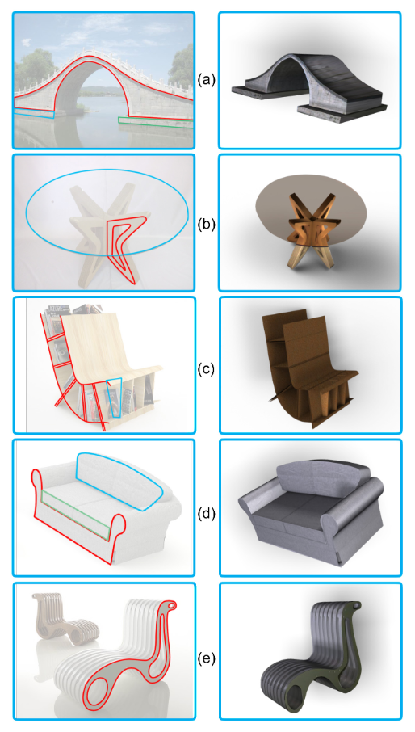

## Interactive Image-Guided Modeling of Extruded Shapes
- ## Metadata
  
  * Item Type: [[Article]]
  * Authors: [[Yan-Pei Cao]], [[Tao Ju]], [[Zhao Fu]], [[Shi-Min Hu]]
  * Date: [[2014]]
  * Date Added: [[2022-03-16]]
  * Cite key: caoInteractiveImageGuidedModeling2014
  * Topics: [[图形学]] [[交互式 3D 建模]]
  , #zotero, #literature-notes, #reference
  PDF附件
- [Cao 等。 - 2014 - Interactive Image-Guided Modeling of Extruded Shap.pdf](zotero://open-pdf/library/items/6BR7KXKP)
- 
- [[摘要]]: 
  A recent trend in interactive modeling of 3D shapes from a single image is designing minimal interfaces, and accompanying algorithms, for modeling a specific class of objects. Expanding upon the range of shapes that existing minimal interfaces can model, we present an interactive image-guided tool for modeling shapes made up of extruded parts. An extruded part is represented by extruding a closed planar curve, called base, in the direction orthogonal to the base. To model each extruded part, the user only needs to sketch the projected base shape in the image. The main technical contribution is a novel optimization-based approach for recovering the 3D normal of the base of an extruded object by exploring both geometric regularity of the sketched curve and image contents. We developed a convenient interface for modeling multi-part shapes and a method for optimizing the relative placement of the parts. Our tool is validated using synthetic data and tested on real-world images.
- ## Abstract
	- 趋势(也是目的)：设计制作一款软件 demo 和算法，以实现由单一图像，生成 3D 交互式建模
	- ((625b8f9f-91ab-4503-97cf-a3440ed7e298))
	- 提出的方法：
		- 提出了一种交互式图像引导工具，用于对由挤压部件组成的形状进行建模。挤压零件表示为与底部正交的方向上拉伸封闭的平面曲线(称为底部)。挤压零件的建模只需要用户绘制基本的投影图像
	- 技术创新：
		- 主要的技术贡献是通过探索草图曲线的几何规则性和图像内容来恢复被挤压物体底部的三维法线的一种新的基于优化的方法
		- ((625b9131-7796-40de-96ad-604cb30aee9a))
	- 实验：
		- 开发一个界面，对多部分形状进行建模，并开发一种优化各部分相对位置的方法
		- 工具使用合成数据进行验证，并在真实世界的图像上进行测试
- ## Introduction
	- challenge
		- 建模流程。从一张图片（a）开始，**用户描画**出一个挤压部件的基底（如插图所示），系统据此重构出三维形状（b）。用户通过复制和转换（三维）现有零件（c）或单独为新零件建模（d）来创建更多的零件。系统对零件的位置进行优化，并将结果模型的纹理可视化（e）
		  
			- a -> b 这一步，自动构建的 3D 模型直位置深度。最后系统自动确定每个部分的深度，并最终模型可查看和纹理化
		- 技术贡献
			- 提出了优化方法，从投影基础形状和挤压方向重建挤压形状
				- 结合了对基本形状的规则性约束，这些约束借鉴了 literature on wireframe reconstruction，以及来自图像内容的**约束**
			- 提出了一种优化多个部件的 3D 放置的方法
				- 该方法结合了部件之间的规律性约束、图像内容和可选的用户输入(例如，两个部件之间的接触边缘或点)
		- 挤压件是双边对称的，表面也不需要分段线性
		  collapsed:: true
			- 
		- **以前的工具可以从简单的用户输入和基本形状的先验知识，但对于一个任意的和位置的基本形状来说，orientation 任务要难得多，是一个关键的难题。**
		  ((625cfdae-04e8-409f-b563-6ba5d4a044b2))
		- 工具提供的内容：一张图像，以及该视图的草图
	- motivation
		- 选择挤压件来建模的基本原理：
			- 1. 存在于人造物体中，具有任意的 2D 形状，并可能具有弯曲的侧面
			  2. 形状的定义：可以完全由底座的形状和位置上挤压量(即厚度)来表示
		- 与一般的自由形式对象相比，挤压部件的简单性使得建模成为可能
		-
	- problem statement
		- **是把模型也渲染了吗？**
- ## Structure
	- ### Camera model and calibration
		- 假设一个简化的相机模型具有零偏斜(zero skew)和径向畸变(radial distortion)，因此投影(projection)完全由相机的焦距(focal length)和视平面（view plane）上的平移向量(translation vector)决定
		- 使用消失点法(vanishing point methods) ((625d01d7-bf5b-4985-ac6f-318c67365fac))，自动获取相机参数。但检测和使用消失点法可能会使数值不稳定 ((625d0280-9e89-4cae-9ffe-a04631720de9))。为了提高稳健性，采用 ((625b9a11-db4d-4f7d-ade5-f7c51b8e3c50)) 这篇论文中的用户引导方法：
			- 用户通过提供图像中的两个角(corners)，每个角有一个点和三个轴方向，并调整投影的平行线来帮助求解相机参数
	- ### Modeling an extruded object
		- 面向观察者(相机)的平面为底座(base)，另一个相同但相反的面成为盖(cap)，其余部分称为侧边（side），由成为 rail 的平行线段的单参数族(one-parameter family)组成。
		  ((625d0438-80aa-415a-92b6-ac136f9293ac))
		  论文定义中的挤压形状是具有直轴和相同横截面的广义圆柱体的特殊情况
		- 算法假设基础形状存在一定的规律性：它需要具有双边对称的部分或相互平行或正交的直边，同时还利用图像中底部和顶部的边界曲线，所以要求 base 和 cap 必须部分不可见，如不完全包括或隐藏
		- 需要建模挤压件，用户需要在图像中绘制 base 和一根 rail，两者都是 3D 对应物的 2D 投影，然后算法构建对象的 3D 几何，up to its distance from the camera origin.
		- #### User interface
			- 制作了一个类似磁性所套的捕捉功能
			- 将 ((625d0d81-1494-4d22-a1ee-26d1c68a55ac)) 应用于图像，然后 ((625d0dd4-5577-484b-98a0-6da62c93f85b)) 。当用户的光标移动到折痕段附近时，该段会自动选择并连接到现有的草图上。如图3(b)中的基本曲线就是用工具描画的
			  ((625d0ec3-9ab0-4d74-b583-a739f1f61639))
			- 用户可以手动画 rail，也可以从系统自动检测到的 rail 中选择，如图 3(c)
		- #### Problem formulation
			- 根据 2D base cruve 和 2D rail，3D extruded object 可以由 base 所在的 3D plane 决定
			- 将 2D base 和 rail 分别投射到 base plane 和 normal direction(法线向量)，就能得到 3D base 和 3D rail
			- 要找到一个使 base shape(one the base plane)和图像一致性最大化的 base plane
				- 找到一个具有强对称性的 base plane，如果有直边的话，要尽可能地正交(asorthogonal)或平行
				- cap 应该与图像的强折痕(image edges/creases)对齐
			- 目标是不随 base plane 在 viewing direction 上的平移而变化，所以 optimization 中唯一的变量是 base plane 的法向量，记为 $n$，假设该 plane 通过空间中的某个固定点，在有多个物体的情况下，该点将被调整
			- ##### Parallelism
				- 衡量 base curve 的直边之间的平移量。首先沿着草图上的 2D base 检测直线段。对于每一条线段 $s$，同时给定 base plane 法线 $n$，我们定义 $$s_n$$ 为 base plane 上的 3D line segment，投影于 $$s$$
				- ((625f6bdf-1042-4d79-9fac-85f506358c6a))
			-
- ## Method
	- Questions
	- [[Research ideas]]
		- 底部截面能否用神经网络提取并识别
	- Related
		- 从检测到的边缘像素创建连续曲线(we call "creases")
		  id:: 625d0dd4-5577-484b-98a0-6da62c93f85b
			- CHENGM.-M.:   Curve structure extraction for cartoonimages, 2009. 4
		- 快速边缘检测器
		  id:: 625d0d81-1494-4d22-a1ee-26d1c68a55ac
			- DOLLÁRP.,  APPELR.,  BELONGIES.,  PERONAP.:Fast feature pyramids for object detection.PAMI(2014). 4
		- 立方体(cuboids)建模：根据用户提供的六边形边界，在图像中重建方体物体
			- ZHENGY., CHENX., CHENGM.-M., ZHOUK., HUS.-M.,  MITRAN.  J.:   Interactive  images:  Cuboid  proxies  forsmart image manipulation.ACM Trans. Graph. 31, 4 (July 2012),99:1–99:11. 1, 3
		- 管状物(tubular  shapes)建模：从用户笔触的形状，并在其底部重建管状物体
			- CHENT., ZHUZ., SHAMIRA., HUS.-M., COHEN-ORD.: 3-sweep: Extracting editable objects from a single photo.ACM Trans. Graph. 32, 6 (Nov. 2013), 195:1–195:10. 1, 3, 6
		- 对称结构(symmetric architecture)：开发一种用于图像引导建筑建模的交互式系统，该系统利用建筑的典型地壳状对称性，用户通过笔触定义一个初步的地壳状模型
			- JIANGN.,  TANP.,  CHEONGL.-F.:   Symmetric archi-tecture modeling with a single image.ACM Trans. Graph. 28, 5(Dec. 2009), 113:1–113:8. 1, 3
		- 具有平面切面的对称形状(symmetricshapes with planar facets)：给定用户标记的对称线和深度不连续的情况下，重建图像中的非对称的片状平面物体
		  id:: 625b9a11-db4d-4f7d-ade5-f7c51b8e3c50
			- XUET.,  LIUJ.,  TANGX.:   3-d modeling from a sin-gle view of a symmetric object.IEEE Transactions on ImageProcessing 21, 9 (2012), 4180–4189. 1, 3
		- Interpretation of 2D wireframesis in computer vision：
			- SUGIHARAK.:Machine Interpretation of Line Draw-ings. Artificial Intelligence Series. MIT Press, 1986. 3
		- 允许用户只提供所需形状的粗略草图，并从数据库中重新检索相似形状
			- EITZM.,  RICHTERR.,  BOUBEKEURT.,  HILDE-BRANDK.,  ALEXAM.:   Sketch-based  shape  retrieval.ACMTrans. Graph. (Proc. SIGGRAPH) 31, 4 (2012), 31:1–31:10. 3
			- XUK.,  CHENK.,  FUH.,  SUNW.-L.,  HUS.-M.:Sketch2scene: Sketch-based co-retrieval and co-placement of 3dmodels.ACM Transactions on Graphics 32, 4 (2013), 123:1–123:12. 3
		- 对重新检索的米行进行变形以使其适合图像
			- XUK., ZHENGH., ZHANGH., COHEN-ORD., LIUL., XIONGY.: Photo-inspired model-driven 3d object modeling.ACM Trans. Graph. 30, 4 (July 2011), 80:1–80:10. 3
		- 使用可变形模型从单个图像中估计人的形状
			- [CGZZ13]CHENX., GUOY., ZHOUB., ZHAOQ.: Deformablemodel  for  estimating  clothed  and  naked  human  shapes  from  asingle image.The Visual Computer 29, 11 (2013), 1187–1196. 3
		- 论文中使用的消失点法出自这本书
		  id:: 625d01d7-bf5b-4985-ac6f-318c67365fac
			- HARTLEYR.,  ZISSERMANA.:Multiple View Geome-try in Computer Vision, 2 ed.  Cambridge University Press, NewYork, NY, USA, 2003. 3
		- 几何约束进行校准和 3D 建模
		  id:: 625d0280-9e89-4cae-9ffe-a04631720de9
			- WILCZKOWIAKM.,  STURMP.  F.,  BOYERE.:   Us-ing geometric constraints through parallelepipeds for calibrationand 3d modeling.IEEE Trans. Pattern Anal. Mach. Intell. 27, 2(2005), 194–207. 3
- ## [[Writing skills]]
	- [[Beautiful expressions]]
	- [[Academic phrases]]
##  Zotero links

Zotero条目：[Local library](zotero://select/items/1_U98BH5MR)

* [Cloud library](http://zotero.org/users/8989203/items/U98BH5MR)
-