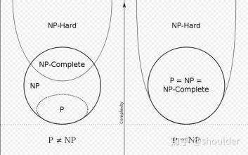

- ## 简单理解版本
	- P 问题：有多项式时间算法，算得很快的问题
	- NP 问题：算起来不确定快不快的问题，但是我们可以快速验证这个问题的解
	- NP-complete 问题：属于 NP 问题，但属于 NP-hard 问题
	- NP-hard 问题：比 NP 问题都要难的问题
- [[多项式]] [[时间复杂度]]
- ## P 类问题
	- 存在多项式时间算法的问题（P：polynominal，多项式）
- ## NP 问题
	- 能在多项式时间内验证得出一个正确解的问题（NP：non-deterministic polynominal，非确定性多项式）
		- 非确定性来自于非确定性图灵机 non-deterministic turing machine(NDTM) 计算模型
	- P 类是 NP 类的子集，即存在`多项式时间算法的问题`，总能在`多项式时间内验证`
- ## NPC 类问题(Nondeterminism Polynomial complete)
	- 存在一个 NP 问题，所有的 NP 问题都可以约化成它。即解决了这个问题，就能解决所有的 NP 问题
	- 定义要满足两个条件
		- 1. 首先得是一个 NP 问题
		  2. 所有的 NP 问题都可以约化到它
- ## NP 难问题(NP-hard 问题)
	- 与 NPC 类似，但不满足第一条，NP-hard 比 NPC 问题要广
	- 即所有的 NP 问题都能约化到它，但它不一定是个 NP 问题
	- 
-