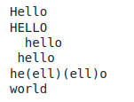
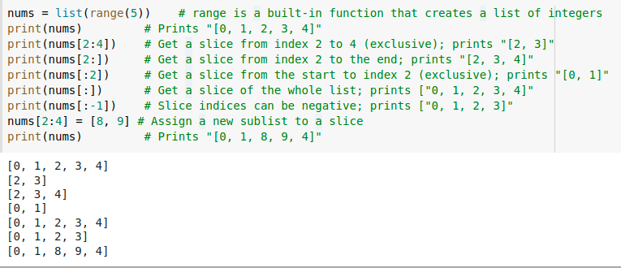
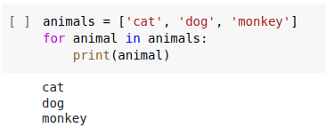
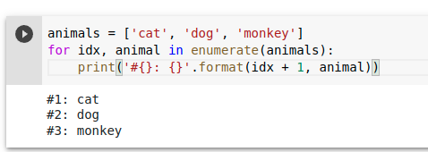
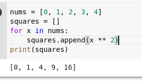
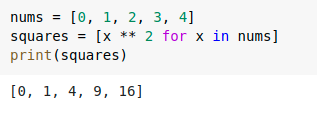
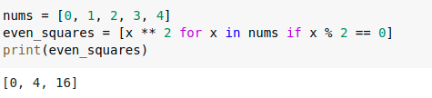

- 求幂是 `**`
- 变量类型用 `type(y)`
- 字符串的串联 `hw = hello + ' ' + world`
- 字符串格式化 `hw12 = '{} {} {}'.format(hello, world, 12)`
- string 其他用法
  ```python
  s = "hello"
  print(s.capitalize())  # Capitalize a string
  print(s.upper())       # Convert a string to uppercase; prints "HELLO"
  print(s.rjust(7))      # Right-justify a string, padding with spaces
  print(s.center(7))     # Center a string, padding with spaces
  print(s.replace('l', '(ell)'))  # Replace all instances of one substring with another
  print('  world '.strip())  # Strip leading and trailing whitespace
  ```
  
- 内置 container 类型：lists, dictionaries, sets, tuples
- list：就是数组，但能调整大小，还能放置不同类型的元素
	- 用负数还能倒过来取地址
	- 在最后加元素 `xs.append('bar')`
	- 去掉最后的元素并返回 `x = xs.pop() `
	- 访问列表中部分元素 
- for 循环
  
	- 加个遍历条件
	  
- 改变列表内元素
  
	- 简化
	  
	- 包括 contain 条件的写法
	  
	-
	-
	-