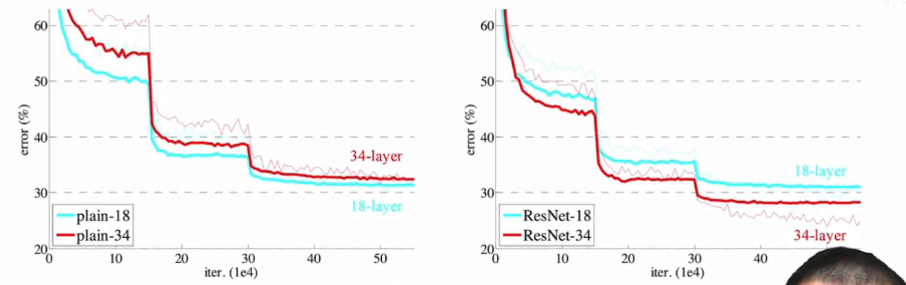
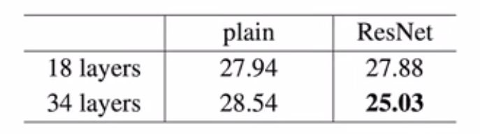
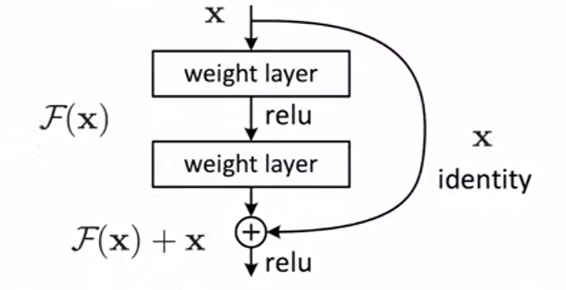
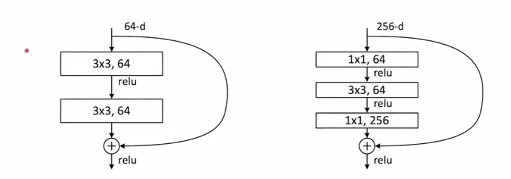
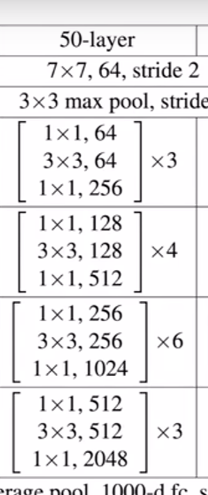

- 论文结构
	- 因为 CVPR 篇幅限制，这篇论文没有结论，但不要学习这样的结构
- 摘要
	- 提出问题：深的神经网络非常难以训练
	- 做了什么：使用一个残差学习的框架，使得训练非常深的网络比之前更容易
	- 提出的方法：把层，作为一个学习残差函数相对于层输入的方法
	- 效果：残差网络容易训练，而且能够得到很好的精度
		- 在 ImageNet 数据集中，使用了 152 层的深度，八倍于 VGG，但有更低的复杂度，赢下第一名
	- 图 1：训练很深的神经网络，当层数过大的时候，训练误差会特别明显
- 图 4
	- 左图：在 ImageNet 数据集上，没有加入残差的时候，用了 18 层和 34 层的结果
	- 右图：加了突出的 ResNet 的时候（全文核心图）
	- 可以看出在没有加入 Residual 残差连接的时候，34 层网络其实比 18 层的网络在训练误差上还高一些
	- 而用了 ResNet 后，34 层的结果，误差更低
	- 
	- 表总结：（图给直观展示，表给详细数据） 
- 导言
	- 介绍：深度卷积神经网络好，因为能加许多层，把网络变得特别深。不同程度的层会得到不同 level 的 feature，比如低级的视觉特征或者高级的语义的视觉特征
	- 提出问题：随着网络越来越深，学习一个网络只是把所有网络简单地堆在一起就好了吗？
		- 网络特别深的时候，梯度要么会爆炸，要么会消失
		- 解决的方法：
			- 权重在随机初始化的时候，不要特别大也不要特别小
			- 在中间加入一些 BN(batch normalization)，可以使得校验每个层之间的输出和梯度的均值和方差，避免有些层特别大有些层特别小
			- 使用以上技术，特别深的网络也是可以收敛的
	- 提出另一个问题：虽然可以收敛了，但网络变深的时候，性能其实是变差的，无论是训练、验证还是测试精度都会变差
		- 这不是因为层数变多、模型变复杂导致的过拟合，而是因为训练误差也变高了
		- 所以虽然网络是收敛的，但没有训练到一个比较好的结果
	- 简单介绍提出的 ResNet
		- 要学的东西叫做 $H(x)$，假设已经有一个浅的网络，输出是 $x$，在上面要新加一些层
		- 新加的层不要直接去学 $H(x)$，而是去学 $F(x) = H(x)-x$
		- 也就是之前已经得到了 $x$，新加的层就不要再去学 $x$，而是学 **学到的东西和真实的东西之间的那个残差**
		- 最后的输出是 $F(x)+x$
		- 
		- 图：输出是原来的 $x$，加上 $F(x)u$，再加一个 $relu$ 激活
		- 即输出不再是自己的输出，而是输出加上了输入
		- 以上也就是 residual
- 神经网络中实现 $F(x)+x$ ：`shortcut connections`，所以做的其实是 `identity mapping`
- 残差连接怎么处理输入和输出形状不等的情况：填零、投影、所有的连接做投影
- bottle neck 瓶颈
	- 
	- 通道数从 64 到 256，复杂度扩大了 16 倍太贵了
	- 处理：通过 1*1 的卷积把他映射，投影回 64 位，再做 3*3 通道数不变的卷积，再投影回 256
	- 这也解释了为什么这么处理
	   
	-
	-