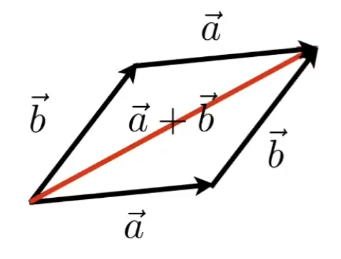
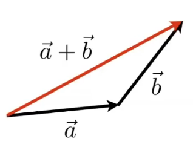
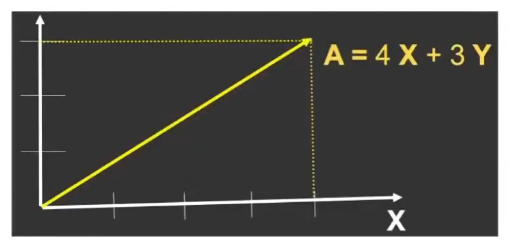

- 向量：只有大小和方向的有向线段，没有位置
	- $A \longrightarrow^{\vec{a}} B$
- 向量描述的位移能被认为是与轴平行的位移序列
- $\overrightarrow{AB} = B - A$
- 向量长度：$|\vec a|$ 取模
- 向量求和
	- 平行四边形法则
	   
	- 三角形法则
	  
- 单位向量：$\hat a = \frac{\vec a}{|\vec a|}$
	- 模等于 1 的向量，有方向，有无数个
- 向量与标量
	- 向量：有大小和方向
	- 标量：只有大小，没有方向
- 零向量
	- 唯一大小为 0 的向量
	- 唯一没有方向的量
	- 不是一个点
	- 表示的是没有位移，零标量表示的是没有数量
- **图形学中向量默认是列向量**
	- $\vec A = \left(\begin{matrix}x\\y\end{matrix}\right)$
	- $\vec A^T = \left(\begin{matrix} x & y \end{matrix}\right)$
- 向量长度：$||\vec A|| = \sqrt {x^2 + y^2}$
  
-