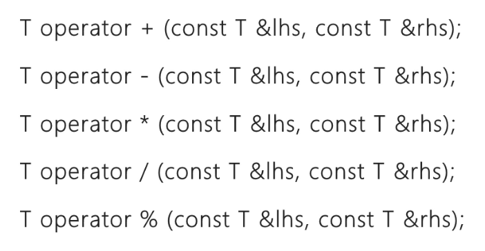
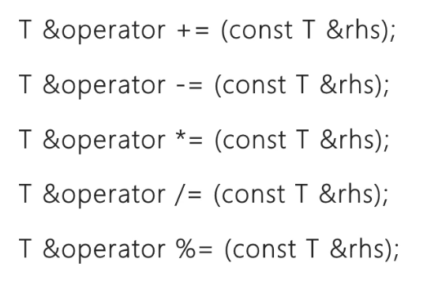
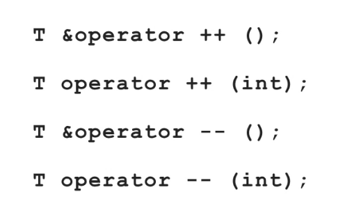
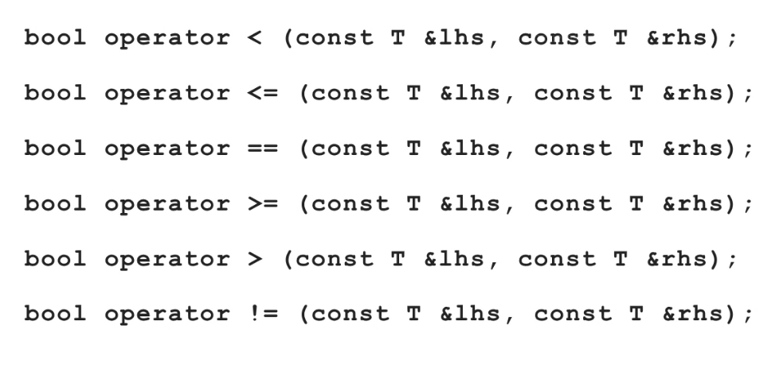

- 第一种操作符重载，有[[成员函数]]，有 `this`
	- C++ 中操作符就是一种函数，是可以重新定义的
	- 编译器会自动把 `c2` 的地址传到 `this` 这个指针中
	- `__doapl` 是 do assignment plus
	- 
- 第二种操作符重载，非成员函数，无 this
	- 和全域函数对比，没有 this 指针
	- 
- 第三种操作符重载，非成员函数,output
	- 
	- 
	- output operator 绝对不能写成成员函数的写法，只能写全局
	- `cout` 是一个对象，是 type，class 名是一种 `ostream`
	- 各种东西往 cout 丢的时候，每次输出都是在改变 `os` 的状态，所以`ostream& os` 不能用 const
	- 如果只是输出一个元素，那函数完全可以用 void，而不需要返回值，因为打印在屏幕上后就好了
	- 但如果是连续输出，就要注意输出一个之后，得到的结果还要继续接收后面的 `<<`，输出顺序是 `c1` , `conj(c1)`
	- 最后返回的不是临时对象，所以其实是可以用 reference 的
	- 
	- 
- 正负号运算符重载
	- 编译器辨别正号和加法的方法：看参数，只有一个参数的就是正号
	- 负号表示一定会有新的东西，所以一定要创造一个临时对象来放新结果
	- 但正号并没有新的结果，没有临时对象，按理是可以用 reference 的
	- 
- 算术运算符
	- {:height 372, :width 702}
- 算术赋值运算符
	- 
- 自增自减运算符
	- 
- 比较运算符
	- 