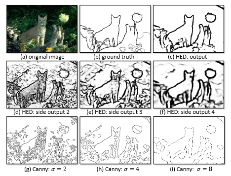
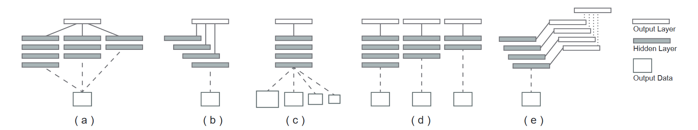
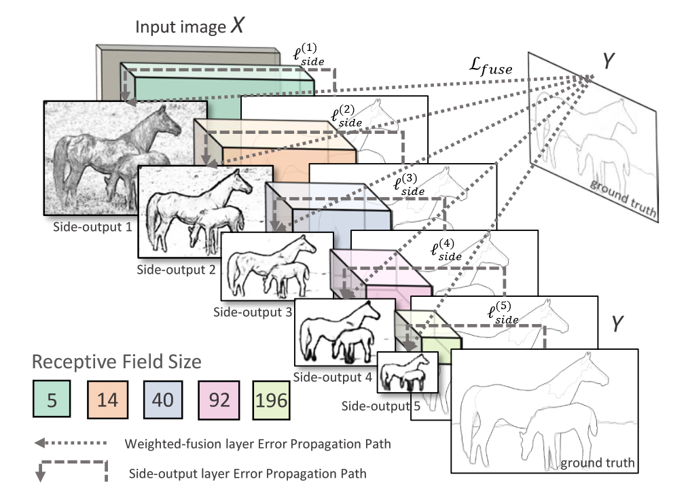
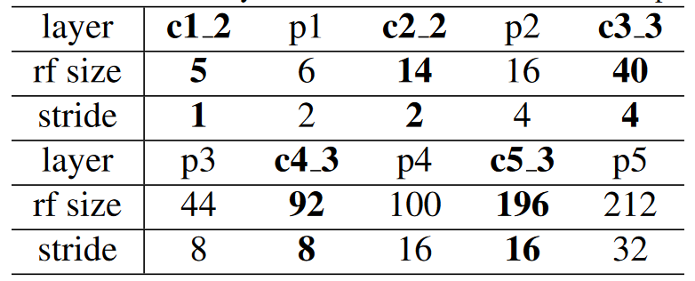
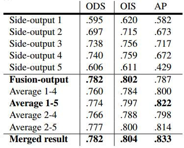
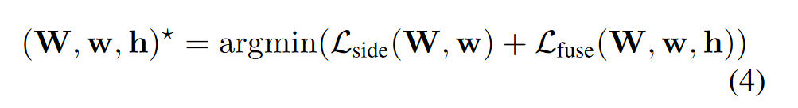
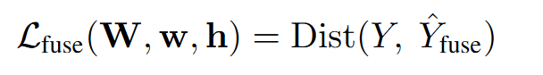
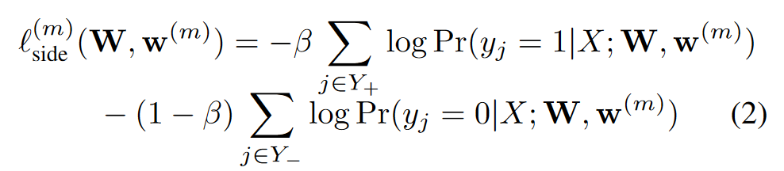
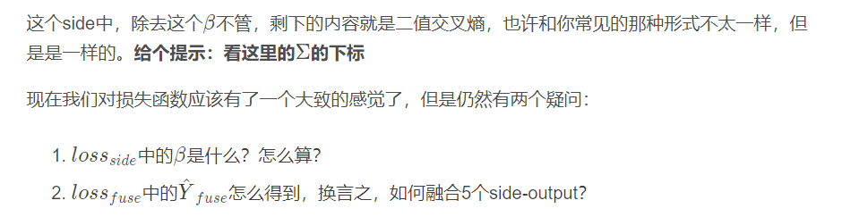
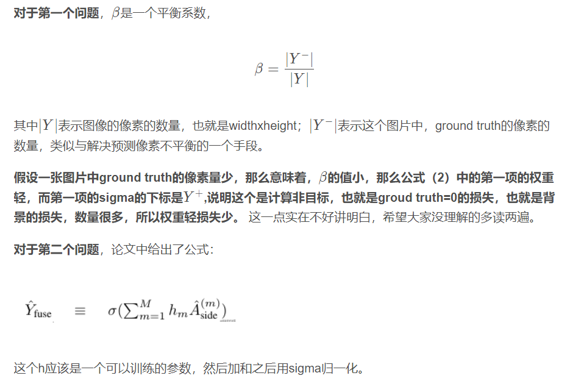

public:: true

# Holistically-Nested Edge Detection
## Metadata

* Item Type: [[Article]]
* Authors: [[Saining Xie]], [[Zhuowen Tu]]
* Date: [[十二月 1, 2017]]
* Date Added: [[2022-06-01]]
* Cite key: xieHolisticallyNestedEdgeDetection2017
* Topics: [[草图生成设计]]
* Tags: #Boundary-detection, #Convolutional-neural-networks, #Deep-learning, #Edge-detection, #Fusion, #Multi-scale-learning, #边缘检测, #zotero, #literature-notes, #reference
* PDF Attachments
	- [Xie 和 Tu - 2017 - Holistically-Nested Edge Detection.pdf](zotero://open-pdf/library/items/BYV72QVM)
## Abstract

We develop a new edge detection algorithm that addresses two important issues in this long-standing vision problem: (1) holistic image training and prediction; and (2) multi-scale and multi-level feature learning. Our proposed method, holistically-nested edge detection (HED), performs image-to-image prediction by means of a deep learning model that leverages fully convolutional neural networks and deeply-supervised nets. HED automatically learns rich hierarchical representations (guided by deep supervision on side responses) that are important in order to resolve the challenging ambiguity in edge and object boundary detection. We significantly advance the state-of-the-art on the BSDS500 dataset (ODS F-score of 0.790) and the NYU Depth dataset (ODS F-score of 0.746), and do so with an improved speed (0.4 s per image) that is orders of magnitude faster than some CNN-based edge detection algorithms developed before HED. We also observe encouraging results on other boundary detection benchmark datasets such as Multicue and PASCAL-Context.
##  Zotero links
* [Local library](zotero://select/items/1_GUFTI6F5)
* [Cloud library](http://zotero.org/users/8989203/items/GUFTI6F5)
- # 论文整体
	- ## 解决的问题
		- 1. 基于**整个图像**的训练和预测
		  2.**多尺度**和**多水平**的特征学习
		- 该算法通过深度学习模型，完成了从**图像到图像**的预测，并通过学习到丰富的**分级特征**，完成边缘检测中的细节问题
	- ## 基本想法
		- 文章提出了 end-to-end 的边缘检测系统，即论文标题 holistically-nested edge detection(HED)
			- holistically 表示边缘预测的结果是基于图像到图像的端对端过程；
			- nested 强调了在生成的输出过程中不断地继承和学习得到精确的边缘预测图的过程
				- 采用了多尺度的方法进行特征的学习，多尺度下的该方法边缘检测结果示意图如下图
				- {:height 354, :width 454}
				- 图中 d,e,f 分别为卷积层 2,3,4 响应得到的边缘检测结果，canny 算子检测会存在断开线的情况，而 HED 基本没有这种现象HED 方法的最后输出远优于 canny 算子
	- ## 创新点
		- 端到端：image-to-image
		- 基于 FCN 和 VGG 改进，同时引出 6 个 loss 进行优化训练，通过多个 side output 输出不同 scale 的边缘，然后通过一个训练的权重融合函数得到最终的边缘输出。可以 solve edge 和物体 boundaries 的 ambiguity
		- 样本不平衡处理方法：class-balanced_sigmoid_cross_entropy
	- ## 数据集
		- BSD500数据集（.782的ODS F-SCORE）和NYU DEPTH DATASET（0.746的ODS F-SCORE）上大大提高了最先进图像）
- # 算法结构
	- 提出 holistically-nested 方法，主要通过几种不同的多尺度深度学习下的结构进行对比说明。
	- 在多尺度方面，有更加内部网络形成的多尺度，和外部网络形成的多尺度。前者是学习神经网络里不同层由于降采样的不同得到的不同尺度特征，结合形成多尺度，后者是通过对输入图像的尺度处理时的多尺度，获得不同尺度信息。具体多尺度下的深度学习分为四种，如下图：
	- 
	- (a) Multi-stream learning，可以看到图中的平行网络下，每个网络通过不同参数和 receptive field 大小的不同，获得多尺度的结果。输入影响是同时进入多个网络处理，得到的特征结果直接反应多尺度，再连接到一个 global out layer 得到输出
	- (b) Skip-layer network learning，主要连接各个单的初始网络流得到特征相应，并将响应结合在一起输出（只有一路 network，从不同层提取信息连接到输出）
	- (a) 和 (b) 都是**使用一个输出的 loss 函数进行单一的回归预测**，而边缘检测可能通过**多个回归预测**得到结合的边缘图效果更好
	- (c) Single model on multiple inputs（不同尺寸的图片输入），单一网络，图像 resize 方法得到多尺度进行输入，该方法在训练和 test 过程中均可加入。同时在非深度学习中也有广泛应用
	- (d) Training independent networks，从 (a) 演化来，通过多个独立网络分别对**不同深度**和**输出loss**进行多尺度预测，该方法下训练样本量较大（训练多个不同的网络（深度不同且 loss 也不同），得到多个不同的输出，缺点是资源消耗太大）
	- (e) Holistically-nested networks，本文的算法结构，从 (d) 演化来，类似一个相互独立网络多尺度预测系统，但是将 multiple side outputs 组合成一个单一深度网络
	- ## 网络结构示意图
		- 
		- ### 与 VGG 相比进行的改动
			- 将 side output layer 与每个 stage（理解为每一组卷积池化）的最后一层卷积相连，也就是 conv 1 2,conv 2 2,conv 3 3,conv 4 3,conv 5 3，这些卷积层的感知野尺寸与对应的 side-output layer 完全相同（作者在conv1_2, conv2_2, conv3_3, conv4_3,conv5_3后面分别引出，然后接入sigmoid_cross_entropy_loss，并且在最后一层，对上面的5层的输出做了concat，同时也接入sigmoid_cross_entropy_loss，这样所有的Loss都等概率的同时训练，从而使得最终得到比较好的模型。）
			- 在卷积层后面侧边插入一个输出层 side-output 层，在 side-output 层上进行 deep supervision，使得结果向着边缘检测方向进行。同时随着 side-output 层越向后大小的变小，将 receptive field 变大，最后通过一个 weighted-fusion layer 得到多尺度下的输出
			- 去掉了 VGG 的最后一个 stage，也就是最后一个池化和后面所有的全连接层。因为全连接层太耗资源了
			- 
		- ### 与 FCN 网络对比
			- 直接替换 FCN-8S 中的 loss 为交叉熵的性能不好，FCN-2S network that adds additional links from the pool1 and pool2 layers
			- 关于 deep supervision
				- 在这里指的是来自side-output 的结果
				  The “fusion-output without deep supervision” result is learned w.r.t Eqn. 3. The “fusion-output with deep supervision” result is learned w.r.t. to Eqn. 4（学习了“融合输出无深度监督”的结果。将“深度监督的融合输出”结果学习到等式）简单的说就是一个模型有多个输出的结构
			- 关于 The role of deep supervision
				- deep supervision terms (specifically, ℓside(W,w(m)):
				  每一层都看做是一个独立的network的输出（在不同的尺度上）
				  实验表明，仅仅用weighted-fusion supervision训练，在高层的side output上很多关键的边缘信息都丢失了
			- 这里 6 个 loss 是同时训练的，如果只训练最后一个 loss，精度就会有所下降
		- ### 网络整体理解
			- 可以看到的是整个过程只有一个卷积+池化的过程，Unet还有上采样的过程，这是不同点；
			- 图中的有5个马的图片，从大到小，从浅到深，纹理越来越少，这分别是经过了maxpool和卷积得到的不同尺寸的输出。从图中可以看到，这些输出叫做side-output 1到side-output 5。
			- 图中这五个特征图经过虚线，得到了一个Y，这个Y是经过“weighted-fusion”得到了，简单的说就是，五个图经过一个可以训练的权重参数，融合成了最终的输出
			- 在预测阶段，可以直接取最后一层的输出结果最为最终结果。也可以将所有的层的输出结果都得到，然后求一个平均作为最终结果。这样做的优势就是会使得精度进一步提高，缺点就是加入额外操作，时间会增加。
			- 如下图所示，side-output1-5分别为第1-5个卷积层的输出。Fusion-output为最后一层的输出，Average1-4 为第1-4个卷积的输出求平均，Average1-5，Average2-4，Average2-5， 依次类推。Merged result为所有层的结果求平均合并后的结果。
			  可以看出，
			- (1) 对于每个单独的层，最后一层做过特征融合后的结果是最好的。
			- (2) 将所有层的结果求平均，对最终准确率会有提升。
			- 
		- ### 损失函数
			- 每一个side-output输出都是损失函数的一部分
			- 分为两部分
				- side-output：上图五个不同尺度的预测结果，通过上采样成原图大小，然后和 mask 做交叉熵。因为有五个图，所以损失是五个的和
				- fusion：五个图 fusion 出得 Y，Y 与 ground truth 的交叉熵，整体损失函数：
				- 
				- 其中为了利用 side-output 的预测结果，增加一层 weighted-fusion layer fusion layer 的损失函数（Dist 使用的是交叉熵）
				- 
				- 训练过程中，由于边缘检测实际是对每个像素进行 2 分类任务，大部分像素为非边缘（90% 以上的像素点为非 edge，因此极度不对称（biased）），只有少部分像素为边缘。针对这种 biased sampling，文献[19] 引入 cost-sensitive loss function，并增加额外的 additional trade-off parameters. 而 HED 中采用一种更简单的方法来保证正负样本的 loss balance，即引入一个像素级的 class-balancing weight β
				- 为了进行正负样本的平衡，引入了 class-balanced_sigmoid_cross_entropy
				- 
				- [参考](https://blog.csdn.net/qq_34107425/article/details/110878749)
				- 
				- 
				- 官方代码
				  ```python
				  def class_balance_sigmoid_cross_entropy(logits,label,name='cross_entropy_loss'):
				      y = tf.cast(label,tf.float32)
				   
				      count_neg = tf.reduce_sum(1.-y)
				      count_pos = tf.reduce_sum(y)
				      beta = count_neg/(count_neg+count_pos)
				   
				      pos_weight = beta/(1-beta)
				      cost = tf.nn.weighted_cross_entropy_with_logits(logits,y,pos_weight)
				      cost = tf.reduce_mean(cost*(1-beta),name=name)
				      return  cost
				   
				  cost = class_balanced_sigmoid_cross_entropy(dsn_fuse, annotation_tensor) + \
				         class_balanced_sigmoid_cross_entropy(dsn1, annotation_tensor) + \
				         class_balanced_sigmoid_cross_entropy(dsn2, annotation_tensor) + \
				         class_balanced_sigmoid_cross_entropy(dsn3, annotation_tensor) + \
				         class_balanced_sigmoid_cross_entropy(dsn4, annotation_tensor) + \
				         class_balanced_sigmoid_cross_entropy(dsn5, annotation_tensor)
				  ```
	- ## 测试阶段
		- 给定图片X，我们从side-output layer和weighted-fusion layer同时获得边缘预测结果
		- 最终的输出就是将这些结果进行一个聚合。
- # 相关文献
	- HED是一个边缘检测模型，但是使用的和Unet的框架有些类似。HED使用了deep supervision的方法，而Unet并没有，这里我突然想到Unet++ 的结构，Unet++的思想完全可以沿着Unet+HED这条线路诞生。
		- [Unet 图像分割](https://zhuanlan.zhihu.com/p/57530767)
		- [Unet 论文精读](https://zhuanlan.zhihu.com/p/72691417)
		-