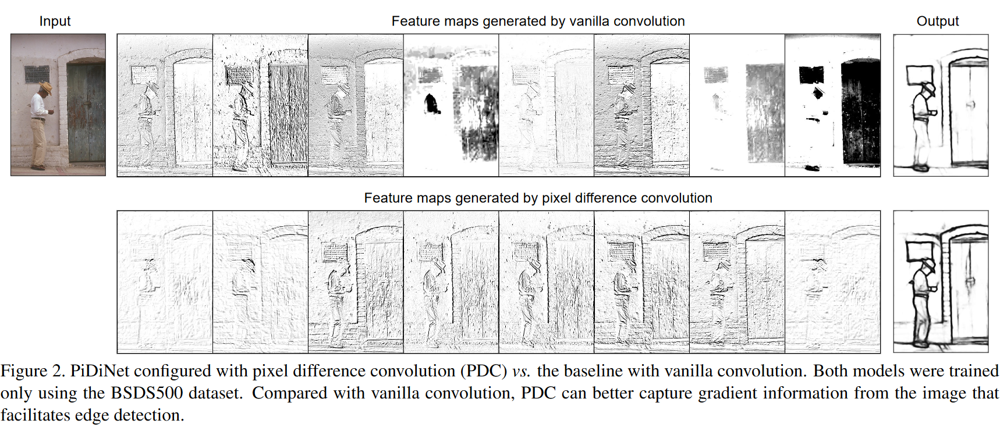

## Pixel Difference Networks for Efficient Edge Detection #待读

[[摘要]]: 
Recently, deep Convolutional Neural Networks (CNNs) can achieve human-level performance in edge detection with the rich and abstract edge representation capacities. However, the high performance of CNN based edge detection is achieved with a large pretrained CNN backbone, which is memory and energy consuming. In addition, it is surprising that the previous wisdom from the traditional edge detectors, such as Canny, Sobel, and LBP are rarely investigated in the rapid-developing deep learning era. To address these issues, we propose a simple, lightweight yet effective architecture named Pixel Difference Network (PiDiNet) for efficient edge detection. Extensive experiments on BSDS500, NYUD, and Multicue are provided to demonstrate its effectiveness, and its high training and inference efficiency. Surprisingly, when training from scratch with only the BSDS500 and VOC datasets, PiDiNet can surpass the recorded result of human perception (0.807 vs. 0.803 in ODS F-measure) on the BSDS500 dataset with 100 FPS and less than 1M parameters. A faster version of PiDiNet with less than 0.1M parameters can still achieve comparable performance among state of the arts with 200 FPS. Results on the NYUD and Multicue datasets show similar observations. The codes are available at https://github.com/zhuoinoulu/pidinet.
### Zotero元数据
#### Zotero条目：[Local library](zotero://select/items/1_IH7EZYUG)
#### PDF附件
- [Su et al_2021_Pixel Difference Networks for Efficient Edge Detection.pdf](zotero://open-pdf/library/items/557AG5D3)
#### 在线访问: [http://arxiv.org/abs/2108.07009](http://arxiv.org/abs/2108.07009)
#### 引用格式:
-
- # 笔记
	- 摘要
		- 提出 Pixel 差异网络（PIDINET）的体系结构，进行边缘检测
		- 与 vanilla 网络生成的效果对比
		- 
			-