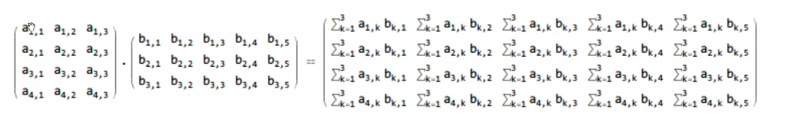

- 矩阵乘法
	- 
	- 第一个 4×3, 第二个 3×5, 得到的就是 4×5
	- 乘积举例：
		- 第一个矩阵所在的行，和第二个矩阵所在的列上元素分别相乘后，得到的和
- 内联快捷键 ctrl + alt + n
- [[assert]]
- 第一种表现形式
	- ```C++
	  class Matrix {
	      double **data;
	      size_t row;
	      size_t col;
	  public:
	      Matrix(size_t row, size_t col) {
	          this->row = row;
	          this->col = col;
	          data = new double *[row];
	          for (int i = 0; i < row; ++i) {
	              data[i] = new double[col];
	          }
	      }
	  };
	  ```
- 第二种表现形式：所有数据存在一起
	- id:: 624f7cbc-06b8-42b8-9adf-006daa42c4e9
	  ```C++
	  class Matrix {
	      double *data;
	      size_t row;
	      size_t col;
	  public:
	      Matrix(size_t row, size_t col) {
	          this->row = row;
	          this->col = col;
	          data = new double [row*col];
	      }
	  };
	  ```
- 大三
	- ```C++
	     Matrix(const Matrix &other){
	          this->row = other.row;
	          this->col = other.col;
	          data = new double(row*col);
	          for(int i = 0; i < row * col; ++i){
	              data[i] = other.data[i];
	          }
	      }
	  
	      Matrix &operator = (const Matrix &other){
	          if(data != nullptr){
	              delete []data;
	          }
	          this->row = other.row;
	          this->col = other.col;
	          data = new double(row*col);
	          for(int i = 0; i < row * col; ++i){
	              data[i] = other.data[i];
	          }
	      }
	  
	      ~Matrix()
	      {
	          delete [] data;
	      }
	  ```